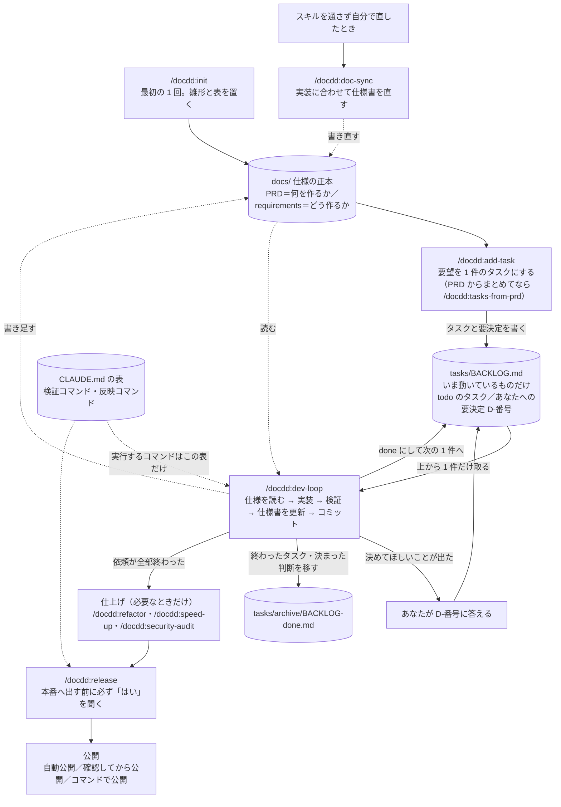

# docdd — 非エンジニアのための Claude Code 開発キット

Claude Code のプラグイン マーケットプレイスです。プラグイン `docdd` を入れると、1 人の非エンジニアが Web アプリやゲームなどを作り続けるための「約束（CLAUDE.md）・仕様書（docs）・作業キュー（BACKLOG）・手順書（スキル）」がそろいます。
要望をタスクにし、実装・検証・仕様書の更新・コミット・本番反映までを、毎回同じ手順で Claude Code に進めさせます。
Claude Code（ターミナル・Desktop・IDE）向けです。
背景と考え方はブログ記事「[コードを書けなくても Claude Code でアプリを壊さず作り続ける「4つのファイル」の仕組み](https://exosai.net/blog/claude-code-non-engineer-workflow)」にあります。

## 全体像

あなたが打つのは図の四角（`/docdd:…`）だけで、丸みのある箱はファイルです。

| 置き場 | 何が入るか | 誰が書くか |
|---|---|---|
| `CLAUDE.md`・`.claude/rules/docdd-kit.md` | 毎回読まれる約束。このプロジェクトの検証コマンドと反映コマンドの表 | init が置き、あなたが直す |
| `docs/`（まず `docs/PRD.md`） | 何を作るか・どう作るかの正本（正しい 1 か所）。技術判断の記録（ADR）と、控えと戻し方などの運用文書もここ | あなたと Claude |
| `tasks/BACKLOG.md`（と `tasks/archive/`） | **作業キュー**。いま動いているタスク（todo・doing）と「要決定」（あなたに決めてほしいこと）だけを置き、終わったものはアーカイブへ移す。dev-loop はここから 1 件だけ取る | スキルが書き、あなたが決める |
| スキル（`/docdd:…`） | 起票・開発・検証・反映の決まった手順 | プラグインが持つ |

- **スキルを通さずに自分でコードを直したときは、`/docdd:doc-sync` を打ちます**（仕様書と実装がずれたままにしない）。`/docdd:dev-loop` と `/docdd:refactor` は中で doc-sync を呼ぶので、その必要はありません。
- 本番へ出す前に、必要なら仕上げを回します。`/docdd:refactor`（中身を整える）・`/docdd:speed-up`（表示が遅い）・`/docdd:security-audit`（公開前や、ログイン・課金・外部連携を触ったあと）。
- ほかにも検証・点検のスキルがあります（全 15 本。`/docdd:` と打つと一覧が出ます）。
- 本番へ出す操作は `/docdd:release` だけで、あなたが自分で打ったときにしか動かず、出す前に必ずあなたの「はい」を聞きます。公開のしかたは init で選び、あとから変えられます。データの控えと、壊れたときに前の版へ戻す手順は「[控えと戻し方](plugins/docdd/README.md#控えと戻し方壊れたときに戻せるようにする)」にあります。
- 取り消しにくい git 操作と、秘密の値（API キーなど）が入ったコミットは、プラグインの hook（自動の見張り）が止めます。

## 使える条件

- **Claude Code の有料プラン**（Pro・Max・Team・Enterprise）か Console のアカウント。ターミナル・Desktop アプリ・VS Code などで使えます。ブラウザで動く claude.ai/code では `/plugin` が使えないので、この手順では入れられません。
- **git と Node.js 18 以上**。macOS・Linux で使えます。Windows は Git for Windows を入れれば動く見込みですが、実機では確かめていません。
- **1 人で、日本語で**使う前提です。チームで分担するための仕組みはありません。
- **作るものの技術は問いません**（仕様書・タスク・コミットの流れはどれでも同じ）。ただし、テストやビルドのコマンドが自動で整うのは Next.js・Vite などの Node.js の Web アプリが中心で、ほかの技術では一部、または全部を自分で書きます（init が聞くので、分かる範囲で答えます）。画面を開いて確かめるスキルは Web アプリ向けで、Unity などのゲームやネイティブアプリでは飛ばします。
- **本番へ出す `/docdd:release`** には、git の push 先が要ります。GitHub で gh（GitHub をコマンドで操作する道具）にログインしていれば、PR の作成と CI の待ちまで自動で進みます。

技術ごとの詳しい対応は「[どこまで使えるか](plugins/docdd/README.md#どこまで使えるか)」にあります。

## 入れ方

**用意するもの**: Claude Code（有料プラン）・git・Node.js 18 以上。入れるのに GitHub のアカウントは要りません。

### 1. アプリのフォルダを用意する（すでにアプリがあれば飛ばす）

1. 空のフォルダを作り、そこで Claude Code を開く（ターミナルなら `mkdir my-app && cd my-app && claude`）
2. Claude Code に頼む: 「Next.js で新しいアプリの土台を作って、`npm run dev` で画面が出るところまで」
   - Next.js 以外でもよい（例: 「Vite と React で」「Python の FastAPI で」）。Unity などのゲームは、Unity Hub で新しいプロジェクトを作る
3. ブラウザで画面が出たら完了

先に土台を作るのは、あとから土台を作ろうとすると、道具（create-next-app など）が「フォルダが空でない」と止まることがあるためです。

### 2. docdd を入れる

アプリのフォルダで Claude Code を開き、次を順に打ちます。

1. `/plugin marketplace add no1013kota/claude-docdd-dev-kit`
2. `/plugin install docdd@claude-docdd-dev-kit`
3. `/docdd:init`（プロジェクト名や作りたいものを聞かれるので、答えていく）

1・2 は一度だけで、ほかのプロジェクトでも使えます。新しいプロジェクトでは 3 だけを打ちます。

## 詳しい説明書

**使い方の詳細は [plugins/docdd/README.md](plugins/docdd/README.md) にあります。** Windows や Desktop アプリで入れるときは「[前提](plugins/docdd/README.md#前提)」、init が終わったら「[init のあとにやること](plugins/docdd/README.md#init-のあとにやること)」、英語の確認が出て迷ったら「[英語で出る確認と答え方](plugins/docdd/README.md#英語で出る確認と答え方)」を読みます。

変更履歴は [plugins/docdd/CHANGELOG.md](plugins/docdd/CHANGELOG.md)。

## 困ったら

[Issues](https://github.com/no1013kota/claude-docdd-dev-kit/issues/new/choose) へ。不具合・質問（分かりにくい所）・要望の中から選べます（日本語で書けます。無料の GitHub アカウントが要ります）。書いてほしいことは、選んだ画面に出ます。API キーや `.env` の中身は貼らないでください。

## ライセンス

Apache-2.0（[LICENSE](LICENSE)）。
playwright-cli スキルの一部は [microsoft/playwright-cli](https://github.com/microsoft/playwright-cli)（Apache-2.0、Copyright (c) Microsoft Corporation）に由来します。詳しくは [NOTICE](NOTICE)。
