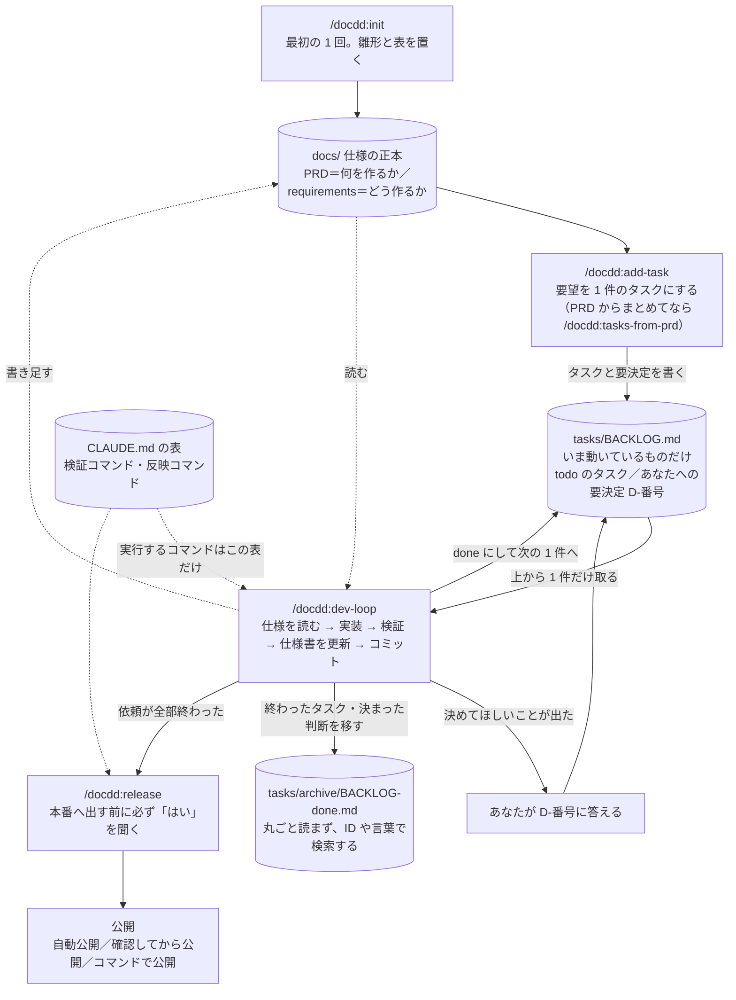

# docdd — 非エンジニアのための Claude Code 開発キット

Claude Code のプラグイン マーケットプレイスです。プラグイン `docdd` を入れると、1 人の非エンジニアが Web アプリやゲームなどを作り続けるための「約束（CLAUDE.md）・仕様書（docs）・作業キュー（BACKLOG）・手順書（スキル）」がそろいます。
要望をタスクにし、実装・検証・仕様書の更新・コミット・本番反映までを、毎回同じ手順で Claude Code に進めさせます。
作るものの技術（React・Vue・Python など）は問いません。Web アプリが中心ですが、Unity などのゲーム・ネイティブアプリでも、仕様書・タスク・検証の表の進め方は使えます（Web 専用のスキルは「該当なし」で止まります）。検査スクリプトは Node.js 18 以上、本番反映の手順は GitHub を前提にしています。
Claude Code（ターミナル・Desktop・IDE）向けです。git・Node.js・ターミナルが要るので、Cowork では動作を確かめていません。
背景と考え方はブログ記事「[コードを書けなくても Claude Code でアプリを壊さず作り続ける「4つのファイル」の仕組み](https://exosai.net/blog/claude-code-non-engineer-workflow)」にあります。

**English summary**: docdd is a Japanese-language Claude Code plugin for solo non-engineers who build and run web apps, games and more. It sets up a spec-driven workflow in your project: a `CLAUDE.md` with verification and release command tables, a PRD and requirements docs as the single source of truth, a task backlog with a "decisions needed" queue, and doc-consistency check scripts. Its skills turn a request into a task, implement and verify it, sync the docs, commit, and release. In docdd projects, a PreToolUse hook blocks risky git operations (bulk `git add`, `--amend`, `--no-verify`, force push) and commits that contain secrets such as private keys, known API key formats and `.env` files. Web apps come first: in non-web projects such as Unity games, the web-only skills report "not applicable" and stop. Requirements: a paid Claude Code plan (Pro, Max, Team or Enterprise) or a Console account, git, Node.js 18 or later, and a terminal. It is built for Claude Code in the terminal, the Desktop app and IDE extensions, and has not been tested in Cowork.

## 全体像

docdd は、プロジェクトに**4 つの置き場**（約束・仕様書・作業キュー・手順書）をそろえ、要望から本番反映までを毎回同じ順で進めます。あなたが打つのは図の四角（`/docdd:…`）だけで、丸みのある箱はファイルです。

| 置き場 | 何が入るか | 誰が書くか |
|---|---|---|
| `CLAUDE.md`・`.claude/rules/docdd-kit.md` | 毎回読まれる約束。このプロジェクトの検証コマンドと反映コマンドの表 | init が置き、あなたが直す |
| `docs/`（まず `docs/PRD.md`） | 何を作るか・どう作るかの正本（正しい 1 か所） | あなたと Claude |
| `tasks/BACKLOG.md`（と `tasks/archive/`） | **作業キュー**。いま動いているタスク（todo・doing）と「要決定」（あなたに決めてほしいこと）だけを置き、終わったものはアーカイブへ移す。dev-loop はここから 1 件だけ取る | スキルが書き、あなたが決める |
| スキル（`/docdd:…`） | 起票・開発・検証・反映の決まった手順 | プラグインが持つ |

- 手順書（スキル）は、`CLAUDE.md` の表に書いたコマンドだけを実行します。「無い」の行は飛ばし、未記入の行は実行せずに報告します。
- 図の 4 つのコマンド以外にも、検証・整理・点検のスキルがあります（全 15 本。`/docdd:` と打つと一覧が出ます）。
- 本番へ出す操作は `/docdd:release` だけで、あなたが自分で打ったときにしか動きません。公開のしかた（自動公開／確認してから公開／コマンドで公開／まだ公開しない）は init で選び、あとから変えられます。DB の構造変更（migration）を含むときは、本番 DB を変える前にバックアップを取ってから反映します。
- 取り消しにくい git 操作（まとめての `git add`・`--amend`・強制 push）と、秘密の値が入ったコミットは、hook が止めます。

## 入れ方

Claude Code の中で次を順に打ちます。入れるのに GitHub のアカウントは要りません（不具合の報告には、無料の GitHub アカウントが要ります）。

1. `/plugin marketplace add no1013kota/claude-docdd-dev-kit`
2. `/plugin install docdd@claude-docdd-dev-kit`
3. プロジェクトのフォルダで Claude Code を起動し、`/docdd:init`

まだアプリのコードが無いなら、先に土台（例: Next.js）を作って動かしてから、そのフォルダで 3 を打ちます。

ほかの配布元から docdd を入れた場合は、`@` の右の名前（配布元の名前）が `claude-docdd-dev-kit` と違います。更新ややめるときのコマンドでは、`/plugin list` に出る名前を使います。

## 詳しい説明書

**使い方の詳細は [plugins/docdd/README.md](plugins/docdd/README.md) にあります。** 前提（要るもの）・init がすること・init のあとにやること・英語で出る確認への答え方・Web 以外のプロジェクト（例: Unity）での使い方・スキル 15 本の一覧・hook が止める操作・更新・やめるとき・注意点。

変更履歴は [plugins/docdd/CHANGELOG.md](plugins/docdd/CHANGELOG.md)、このリポジトリのリリース手順は [RELEASING.md](RELEASING.md)。

## 困ったら

[Issues](https://github.com/no1013kota/claude-docdd-dev-kit/issues/new/choose) へ。不具合・質問（分かりにくい所）・要望の中から選べます。日本語でも英語でも書けます。
不具合なら、`claude --version` の結果・OS・docdd の版（`/plugin list`）・打ったスキル・失敗したときの文面をそのまま書いてください。API キーや `.env` の中身は貼らないでください。

## ライセンス

Apache-2.0（[LICENSE](LICENSE)）。
playwright-cli スキルの frontmatter（name・description・allowed-tools）は [microsoft/playwright-cli](https://github.com/microsoft/playwright-cli)（Apache-2.0、Copyright (c) Microsoft Corporation）に由来します。v0.4.0 から、上流の英語の手順書（`references/`）は同梱せず、入っている道具の中の公式の手順書を読みます。詳しくは [NOTICE](NOTICE)。
