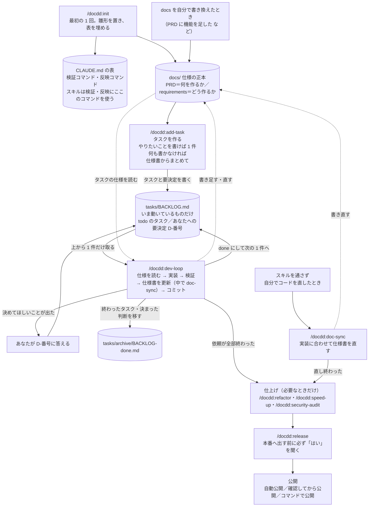

# docdd — 非エンジニアのための Claude Code 開発キット

Claude Code のプラグイン マーケットプレイスです。プラグイン `docdd` を入れると、1 人の非エンジニアが Web アプリやゲームなどを作り続けるための「約束（CLAUDE.md）・仕様書（docs）・作業キュー（BACKLOG）・手順書（スキル）」がそろいます。
要望をタスクにし、実装・検証・仕様書の更新・コミット・本番反映までを、毎回同じ手順で Claude Code に進めさせます。
Claude Code（ターミナル・Desktop・IDE）向けです。
背景と考え方はブログ記事「[コードを書けなくても Claude Code でアプリを壊さず作り続ける「4つのファイル」の仕組み](https://exosai.net/blog/claude-code-non-engineer-workflow)」にあります。

## 全体像

図の `/docdd:…` は、あなたが打つスキル（プラグインが持つ手順書）です。円柱の箱はファイル・フォルダです。

| ファイル・フォルダ | 何が入るか | 誰が書くか |
|---|---|---|
| `CLAUDE.md` | このプロジェクトの約束。検証コマンド・反映コマンドの表と、スキルへの追加指示。Claude が毎回読む | init が置いて表を埋め、あなたが直す |
| `.claude/rules/docdd-kit.md` | どのプロジェクトにも共通の約束（仕様書と実装をそろえる・変更に合わせて回す検証など）。Claude が毎回読む | init が置き、`/docdd:update-kit` が新しい版にする。あなたは直さない（このプロジェクトだけの指示は `CLAUDE.md` へ） |
| `docs/`（まず `docs/PRD.md`） | 何を作るか・どう作るかの正本（正しい 1 か所）。自分で書いた仕様書も置ける。技術判断の記録（ADR）と、控えと戻し方などの運用文書もここ | あなたと Claude |
| `tasks/BACKLOG.md` | **作業キュー**。いま動いているタスクと「要決定」（あなたに決めてほしいこと）だけを置く。dev-loop はここから 1 件ずつ取る | スキルが書き、あなたが要決定に答える |
| `tasks/archive/BACKLOG-done.md` | 終わったタスクと決まった判断 | スキルが移す |

- 図に無いスキル（検証・点検など）も含めた一覧は、次の「[使えるコマンド](#使えるコマンド)」にあります。
- `/docdd:release` は、あなたが自分で打ったときだけ動きます。データの控えと、前の版へ戻す手順は「[控えと戻し方](plugins/docdd/README.md#控えと戻し方)」にあります。
- 取り消しにくい git 操作と、秘密の値（API キーなど）が入ったコミットは、hook（自動の見張り）が止めます。

## 使えるコマンド

Claude Code の入力欄で `/docdd:` と打つと、この一覧が出ます。「自分で打つ」と書いたものは、Claude が会話の流れで勝手に動かすことはありません。

| コマンド | 使うとき |
|---|---|
| `/docdd:init` | 最初の 1 回。雛形を置き、検証コマンドの表を埋める（自分で打つ） |
| `/docdd:add-task <やりたいこと>` | 作りたいこと・直したいことを、1 件のタスクにする |
| `/docdd:add-task`（何も書かない） | 書き換えた仕様書や、まだタスクになっていない所を、まとめてタスクにする |
| `/docdd:dev-loop` | タスクを 1 件、実装・検証・仕様書の更新・コミットまで進める |
| `/docdd:doc-sync` | スキルを通さず自分でコードを直したあと、仕様書を実装に合わせる |
| `/docdd:ui-polish` | 画面や UI 部品を作る・直す（Web のみ） |
| `/docdd:verify-integration` | DB・権限・サーバー側の処理を変えたあとに確かめる |
| `/docdd:verify-e2e` | 利用者の操作の流れを変えたあとに、最後まで通して確かめる |
| `/docdd:refactor` | 動きを変えずに、コードの中身を整える |
| `/docdd:speed-up` | 画面の表示が遅いときに速くする（Web のみ） |
| `/docdd:security-audit` | 公開前や、ログイン・課金・外部連携を触ったあとに、穴を探す |
| `/docdd:release` | 本番へ出す（自分で打つ。出す前に必ずあなたの「はい」を聞く） |
| `/docdd:maintenance` | 週 1 回の点検（`/docdd:maintenance monthly` で月次も） |
| `/docdd:update-kit` | プラグインを更新したあと、置いた雛形を新しい版にする（自分で打つ） |

場面ごとの使い分けは「[毎日の使い方](plugins/docdd/README.md#毎日の使い方)」にあります。

## 使える条件

- **Claude Code の有料プラン**（Pro・Max・Team・Enterprise）か Console のアカウント。ターミナル・Desktop アプリ・VS Code などで使えます（ブラウザで動く claude.ai/code には対応していません）。
- **git と Node.js 18 以上**。macOS・Linux で使えます。Windows では Git for Windows を入れてください。
- **1 人で、日本語で**使う前提です。チームで分担するための仕組みはありません。
- **作るものの技術は問いません**（仕様書・タスク・コミットの流れはどれでも同じです）。テストやビルドのコマンドは、Next.js・Vite などの Node.js の Web アプリなら init がほぼ自動で埋め、ほかの技術では埋まらない所を init が聞くので、分かる範囲で答えます。ブラウザで画面を確かめるスキルは Web アプリ向けで、Unity などのゲームやネイティブアプリでは使いません。
- **本番へ出す `/docdd:release`** には、git の push 先が要ります。公開のしかたが「確認してから公開」「コマンドで公開」なら、gh（GitHub をコマンドで操作する道具）にログインしておくと、PR の作成と CI の待ちまで自動で進みます。

技術ごとの詳しい対応は「[どこまで使えるか](plugins/docdd/README.md#どこまで使えるか)」にあります。

## 入れ方

**用意するもの**: Claude Code（有料プラン）・git・Node.js 18 以上。入れるのに GitHub のアカウントは要りません。

### 1. アプリのフォルダを用意する（すでにアプリがあれば飛ばす）

1. 空のフォルダを作り、そこで Claude Code を開く（ターミナルなら `mkdir my-app && cd my-app && claude`）
2. Claude Code に頼む: 「Next.js で新しいアプリの土台を作って、`npm run dev` で画面が出るところまで」
   - Next.js 以外でもよい（例: 「Vite と React で」「Python の FastAPI で」）。Unity などのゲームは、Unity Hub で新しいプロジェクトを作る
3. ブラウザで画面が出たら完了

土台を作る道具（create-next-app など）は空のフォルダで使うので、docdd より先に作ります。

### 2. docdd を入れる

アプリのフォルダで Claude Code を開き、次を順に打ちます。

1. `/plugin marketplace add no1013kota/claude-docdd-dev-kit`
2. `/plugin install docdd@claude-docdd-dev-kit`（範囲を聞かれたら User）
3. `/docdd:init`（プロジェクト名や作りたいものを聞かれるので、答えていく）

1・2 は一度だけで、ほかのプロジェクトでも使えます。新しいプロジェクトでは 3 だけを打ちます。

## 詳しい説明書

**使い方の詳細は [plugins/docdd/README.md](plugins/docdd/README.md) にあります。** Windows・Desktop アプリ・VS Code で入れるときは「[前提](plugins/docdd/README.md#前提)」、init が終わったら「[init のあとにやること](plugins/docdd/README.md#init-のあとにやること)」、英語の確認が出て迷ったら「[英語で出る確認と答え方](plugins/docdd/README.md#英語で出る確認と答え方)」を読みます。

変更履歴は [plugins/docdd/CHANGELOG.md](plugins/docdd/CHANGELOG.md)。

## 困ったら

[Issues](https://github.com/no1013kota/claude-docdd-dev-kit/issues/new/choose) へ。不具合・質問（分かりにくい所）・要望の中から選べます（日本語で書けます。無料の GitHub アカウントが要ります）。書いてほしいことは、選んだ画面に出ます。API キーや `.env` の中身は貼らないでください。

## ライセンス

Apache-2.0（[LICENSE](LICENSE)）。
playwright-cli スキルの一部は [microsoft/playwright-cli](https://github.com/microsoft/playwright-cli)（Apache-2.0、Copyright (c) Microsoft Corporation）に由来します。詳しくは [NOTICE](NOTICE)。
