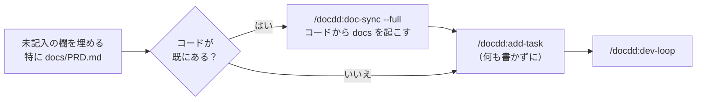
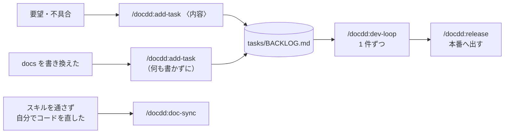
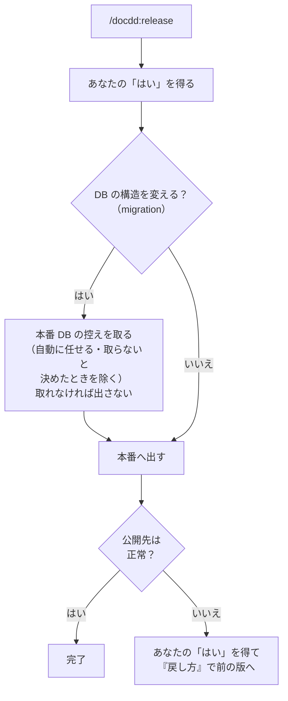
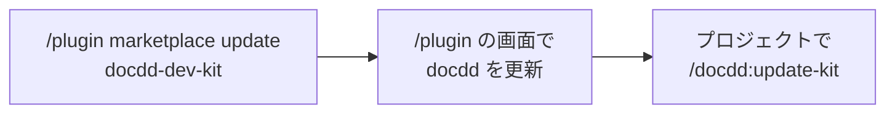

# docdd — 非エンジニアのための Claude Code / Codex 開発キット

1 人で Web アプリやゲームなどを作り続ける非エンジニアのための、Claude Code と Codex のプラグインです。
要望をタスクにし、実装・検証・仕様書の更新・コミット・本番反映までを、毎回同じ手順で進めさせます。
全体の流れの図は [リポジトリの README](../../README.md#全体像) にあります。

| 知りたいこと | 読む所 |
|---|---|
| 自分の環境・プロジェクトで使えるか | [前提](#前提)・[どこまで使えるか](#どこまで使えるか) |
| Codex で使いたい | [Codex で使う](#codex-で使う) |
| 入れ方と、入れたあとの最初の一歩 | [入れ方](#入れ方)・[init のあとにやること](#init-のあとにやること) |
| ふだん何を打てばよいか | [毎日の使い方](#毎日の使い方) |
| 英語の確認が出て迷った | [英語で出る確認と答え方](#英語で出る確認と答え方) |
| 本番で不具合が出たら、前に戻せるか | [控えと戻し方](#控えと戻し方) |
| Unity などのゲーム・ネイティブアプリで使う | [Web 以外のプロジェクトで使う](#web-以外のプロジェクトで使う例-unity) |

## 前提

| 道具 | 要るか | 無いと |
|---|---|---|
| Claude Code（有料プラン: Pro・Max・Team・Enterprise、または Console のアカウント）か Codex CLI | どちらか必須 | 使えない |
| git | 必須 | init が止まり、入れ方を案内する |
| Node.js 18 以上（LTS＝長く保守される版がおすすめ） | 必須 | init が止まり、入れ方を案内する |
| git の push 先（`origin`） | 本番へ出すなら必須 | 本番へ出せない |
| gh（GitHub をコマンドで操作する道具） | 任意 | 「確認してから公開」「コマンドで公開」で GitHub を使うとき、push の前に止まって聞く（gh にログインするか、PR の作成と自動の検査の確認をあなたが GitHub の画面で行うか）。「自動公開」では止まらない |
| playwright-cli（ブラウザを動かす道具） | 任意（Web のみ） | 入れてよいかを聞く。断ると、画面の確認をあなたに見てもらう形に切り替える |

- **Windows**: Git for Windows を入れてください。
- **Desktop アプリ・VS Code**: 画面からも入れられます（Desktop は入力欄の横の ＋ → Plugins、VS Code は入力欄に `/plugins`。配布元に `no1013kota/docdd-dev-kit` を足してから docdd を入れる）。画面で入らないときは、ターミナルで `claude plugin marketplace add no1013kota/docdd-dev-kit` → `claude plugin install docdd@docdd-dev-kit` と打ちます（ターミナルで入れた docdd も、そのまま使えます）。

## どこまで使えるか

仕様書・タスク・コミットの流れは、**どの技術のプロジェクトでも使えます**。環境と技術で変わるのは、次のところです。

### 使える場所

| 使い方 | 使えるか |
|---|---|
| Codex CLI（ターミナル・IDE 拡張） | 使える（[Codex で使う](#codex-で使う)。hook は `/hooks` で信頼してから動く） |
| Claude Code のターミナル（macOS・Linux・Windows）・Desktop アプリ（手元のセッション）・VS Code などの IDE | 使える |
| Desktop アプリの WSL のセッション | 対応していない（プラグインが読み込まれない） |
| claude.ai/code・Desktop アプリのクラウドのセッション | 対応していない（`/plugin` が無く、手元で入れた docdd も持ち込まれない） |
| Cowork | 下の[入れ方](#入れ方)では出ない（Cowork は claude.ai のアカウントに入れたプラグインを使う） |

- 取り消しにくい操作を止める見張り（hook）には、Claude Code 2.1.139 以上が要ります（Windows の PowerShell では 2.1.147 以上）。`claude --version` で確かめ、古ければ `claude update`。
- Claude Code と Codex は同じプロジェクトで併用できます（約束も表も `AGENTS.md` の 1 か所にあるため）。
- 1 人の運営者が日本語で使う前提です。表の見出し・行の名前（『検証コマンド』『要決定』など）は、スクリプトとスキルが字のまま読むので、訳さずに使います。

### プロジェクトの種類

init は、テスト・lint・ビルドなどのコマンドを `AGENTS.md` の「検証コマンド」表に書きます。どこまで自動で埋まるかは技術で変わります。

| プロジェクト | 表の自動の埋まり方 | 『開発サーバー起動』行 |
|---|---|---|
| Node.js の Web アプリ（Next.js・Vite・React・Vite で作った Vue・Svelte・SvelteKit・Remix など） | ほぼ全部（Nuxt・Astro は本番モード起動と型検査を自分で書く） | 自動で入る |
| Python の Web アプリ（Django・FastAPI・Flask） | テスト・lint・型検査・依存の脆弱性（設定か依存に書いてあるものだけ） | 自分で書く |
| Go | テスト・ビルド・lint だけ | 自分で書く |
| Rails・PHP（Laravel など）・Rust・Java・静的な HTML など | ほとんど自分で書く | 自分で書く（Laravel は自動で入るが、`php artisan serve` などに直す） |
| Unity・Godot・Flutter・Android・Xcode／Swift・.NET | ほとんど自分で書く（見本は Unity だけ） | 「無い」になる（[Web 以外のプロジェクトで使う](#web-以外のプロジェクトで使う例-unity)） |

『開発サーバー起動』行が「無い」だと、docdd は画面の無いプロジェクトと見なし、画面を確かめるスキル（ui-polish・speed-up）は「該当なし」で止まります。

<details>
<summary>init のあとに表を直すプロジェクト（Expo・Electron・Vue CLI・ASP.NET など）</summary>

| プロジェクト | init の見立て | 直すこと |
|---|---|---|
| Expo・React Native、Vite や React を使う Electron | Web と見なし、『開発サーバー起動』行に `npm start` などを入れる | 画面のスキルを使わないなら「無い」にする |
| Vue CLI（Vite を使わない Vue） | Web でないと見なし、『開発サーバー起動』行を「無い」にする | 画面のスキルを使うなら、起動のコマンドと開くアドレスを書く（例: `npm run serve`（http://localhost:8080 で開く）） |
| ASP.NET Core・Flutter の Web アプリ | 同上（.csproj が下のフォルダにしか無いときは聞く） | 同上（例: `dotnet watch`（http://localhost:5000 で開く）） |
| package.json も置いてある Python・Go・Rails・Laravel | package.json だけを見て、テスト・lint などを「無い」にする | それぞれのコマンドを書く |
</details>

<details>
<summary>スキルごとに要るもの・気をつけること</summary>

| スキル・場面 | 要るもの・すること |
|---|---|
| `/docdd:release`（本番へ出す） | 「確認してから公開」「コマンドで公開」では、GitHub と gh があれば PR の作成と CI（GitHub Actions）の待ちまで自動。「自動公開」は push で公開するホスティング（Vercel など）が前提 |
| `/docdd:verify-integration`（DB の検証） | 本番と別のテスト用 DB と、『単体・DBテスト』行のコマンド |
| `/docdd:verify-e2e`（操作の検証） | 本番を指さない設定と、送信・課金・メールを実物へ出さない設定（その機能が無ければ要らない） |
| `/docdd:refactor`・`/docdd:speed-up` | 単体テスト（無いと止まる。`--audit` を付ければ見るだけ・測るだけ） |
| モノレポ（1 つのリポジトリに複数のアプリ） | docdd を入れたフォルダで Claude Code を開く |
| Python | 検証コマンドを仮想環境の中で動く形にする（`uv run`・`poetry run` は自動。pip・pipenv は自分で） |
| テストのコマンド | 終わる形にする（`jest --watchAll` のような、見張り続けるものは使わない） |
</details>

## 入れ方


1. **アプリの土台**: まだコードが無ければ、空のフォルダで Claude Code に「Next.js（など）で新しいアプリの土台を作って、動くところまで」と頼みます（Unity などは Unity Hub で作る）。
2. **docdd を入れる**: アプリのフォルダで Claude Code を開き、次を打ちます。ほかのプロジェクトでも使えるので、1 回だけで済みます（Desktop アプリ・VS Code の画面から入れるときは[前提](#前提)）。
   1. `/plugin marketplace add no1013kota/docdd-dev-kit`
   2. `/plugin install docdd@docdd-dev-kit`（範囲を聞かれたら User。会話を読み直す旨の警告が出たときだけ `/reload-plugins --force`）
3. **`/docdd:init`** を打ちます（前置きの無い `/init` は Claude Code の別のコマンドなので打たない）。

`/docdd:init`・`/docdd:release`（本番へ出す）・`/docdd:update-kit`（雛形の更新）は、**あなたが自分で打ったときだけ動きます**。

### init がすること

| すること | 中身 |
|---|---|
| 聞く | 分からないことだけ。選ぶ問い（本番への出し方・テスト用 DB・既存の `AGENTS.md` の扱い・コミットしてよいか など）を先に、書く問い（プロジェクト名・何を作るか・既にある仕様書・公開先 URL など）をあとに |
| 推定する | 検証コマンド（型検査・lint・テストなど）を `package.json` などから書き、推定できなかった行だけを聞く |
| 置く | 雛形（[置かれるファイル](#置かれるファイル)）。既存のファイルは上書きしない。既存の `AGENTS.md` は「表だけ末尾に足す（おすすめ）／置き換える（元は `.bak` に残す）／そのまま」から選ぶ。既にある `CLAUDE.md` は消さず、末尾に `@AGENTS.md` の 1 行だけ足す |
| 報告する | 置いたもの・推定した行・未記入の欄（`ファイル:行`）・次の一手 |

- **既に仕様書やメモがある**なら、問いのときにパスを書くか中身を貼ります。Claude が `docs/PRD.md`（何を作るかを書く文書）の下書きを作って見せます。原文は `docs/_imported/` へ移せます。
- 本番への出し方（自動公開／確認してから公開／コマンドで公開／まだ公開しない）は、あとから `AGENTS.md`「反映コマンド」表の『反映の方式』行で変えられます。
- テスト用 DB は「① 手元で起動する／② ホスト型の開発専用／③ 使わない」から選びます。② は本番と別の、壊してよい接続先にします。
- **何度打っても安全です。** 途中で止まったら、もう一度 `/docdd:init` と打つと、足りない所だけを置き、聞き直します。

<details>
<summary>質問に答えずに最後まで進めたいとき</summary>

`/docdd:init よみログ "読書記録アプリ" commit` のように、プロジェクト名・何を作るか・`commit` を渡すと、質問せずにコミットまで進みます。許可設定（まだ無ければ）も聞かずに置き、既存の `AGENTS.md` には表だけを足し、答えの無い欄は未記入のまま残します。git の準備（管理・名前とメール）が無ければ、止まってすることを伝えます。
</details>

### 英語で出る確認と答え方

| 確認 | 出るとき | 答え方 |
|---|---|---|
| このフォルダを信頼するか | 導入後、次に起動したとき | Yes（これで許可設定が有効になる） |
| MCP サーバー（外部の道具とつなぐ仕組み）に接続してよいか | Next.js で `.mcp.json` を置いたあと | Next.js なら Yes、違えば No |
| `.claude/` のファイルを書き換えてよいか | 許可設定を直してと頼んだときなど | Yes |
| 道具の中の手順書を読んでよいか | Claude が playwright-cli の詳しい手順書（英語）を読むとき | 内容を読んで Yes（断っても進む） |
| このコマンドを実行してよいか | コマンドの前 | 内容を読んで Enter。削除（`rm`）・送信（`git push`）・DB の操作で迷ったら Esc で止め「これは何をするの？」と聞く |
| このコマンドを実行してよいか（"Yes, and don't ask again for …" の行がある） | 使う部品（依存）を足すとき（`npm install` など） | 内容を読んで Yes。"don't ask again" は選ばない |

雛形の許可設定（`.claude/settings.json`）:

| 扱い | コマンド |
|---|---|
| 確認なしで進む | `git add`・`git commit`・検査コマンド |
| 必ず確認が出る | まとめて消す削除（`rm -r`・`rm -f`）・`git push`・部品の追加（`npm install`・`pnpm add`・`yarn add`・`pip install`） |
| 禁止 | 強制 push・`--no-verify`・`sudo`・`.env` と `.env.*`（`.env.example` も）の読み取り |

- `.env` の変数名を見せたいときは、その部分をチャットに貼ります。`.env.example` などを読ませたいときは、「deny の `Read(./.env.*)` を `Read(./.env.local)` のような個別の名前に変えて」と Claude に頼みます。

<details>
<summary>ファイルの編集のたびに確認を出したい・出したくないとき</summary>

編集のたびに確認が出るかは、Claude Code の始まりのモードで決まります（雛形はモードを決めません）。Pro・Max・Team の人は auto モード（別のモデルが安全を確かめて自動で許可する）、Enterprise・Console の API キーの人は毎回確認するモードで始まります。変えたいときは、Claude Code に次のように頼みます（VS Code の拡張では、プロジェクトの設定のモードは使われません）。

| したいこと | 頼むこと |
|---|---|
| 編集のたびに確認したい | 「`.claude/settings.json` の permissions に `"defaultMode": "default"` を足して」 |
| 編集を自動にしたい | 「`.claude/settings.json` の permissions に `"defaultMode": "acceptEdits"` を足して」（`mkdir`・`mv` などのファイル操作も確認なしになる） |
| auto モードで始めたい | 「`.claude/settings.json` の permissions から defaultMode を消して」（Enterprise・API キーの人は、PC 全体の設定 `~/.claude/settings.json` に `"defaultMode": "auto"` を書く） |

公式: https://code.claude.com/docs/en/permission-modes
</details>

## Codex で使う

同じプラグインが Codex CLI でも動きます。ターミナルで 1 回だけ次を打ちます（プロジェクトごとではありません）。

```bash
codex plugin marketplace add no1013kota/docdd-dev-kit
codex plugin add docdd@docdd-dev-kit
```

そのあとプロジェクトのフォルダで `codex` を開き、`$docdd:init` と打ちます。以降はこの README のとおりですが、次の 4 つだけ違います。

| こと | Claude Code | Codex |
|---|---|---|
| スキルの呼び方 | `/docdd:init` | `$docdd:init`（`/skills` で一覧） |
| 毎回読む約束 | `AGENTS.md`（`CLAUDE.md` の 1 行が読み込む） | `AGENTS.md`（そのまま読む） |
| 見張り（hook） | 入れたらすぐ動く | `/hooks` で docdd の hook を確かめて「信頼する」を選ぶまで動かない。フォルダを信頼していないプロジェクトでも動かない |
| 許可設定 | `.claude/settings.json` | 使わない（Codex の承認モードとサンドボックスで決まる） |

- どちらからでも同じプロジェクトを触れます（約束も表も `AGENTS.md` の 1 か所にあるため）。
- **コミットのとき確認が出ます。** Codex はサンドボックスの中で `.git` を書けないようにしているためで、許可するとそのまま進みます（`codex exec` の非対話実行では許可を求められないので、コミットの手前で止まります）。
- Codex が `AGENTS.md` を読むのは 32 KiB までです（超えた分は切れます）。雛形は約 27 KiB なので、長い説明は `docs/` に書きます。30 KiB を超えると `/docdd:init` が知らせます。
- `.mcp.json` は Claude Code 用です。Codex で外部の道具を使うときは、Codex 側の設定に足します。

## init のあとにやること



1. **init の報告に出た未記入の欄（`{{…}}`）を埋めます。** 特に `docs/PRD.md` の「やること（機能一覧）」「やらないこと」。記入例は [`examples/PRD.sample.md`](./examples/PRD.sample.md)（架空の美容室の予約アプリ）。分からない欄は Claude Code に「候補を挙げて質問して」と頼みます。
2. **コードが既にあるなら**、init が案内する `/docdd:doc-sync --full` を打ちます。いまのコードから docs を書き起こします。
3. **何も書かずに `/docdd:add-task`** と打つと、PRD の Must の機能（1 回 7 件まで）をタスクに下書きし、承認を得て起票します。実装済みに見える所はタスクにしません。
4. **`/docdd:dev-loop`** と打つと、タスクを 1 件ずつ進めます。init が「アプリの土台を作る」「テスト基盤の導入」を起票していれば、それが最初のタスクです。

## 毎日の使い方



| こんなとき | 打つもの |
|---|---|
| 作りたいこと・直したいことがある | `/docdd:add-task <やりたいこと>` |
| docs（PRD・requirements・自分で置いた仕様書）を書き換えた | `/docdd:add-task`（何も書かずに。書き換えはコミットせずにそのまま打つ。先にコミットしてしまったら `/docdd:add-task HEAD~1`（2 つ前からなら `HEAD~2`）） |
| タスクを進める | `/docdd:dev-loop`（`/docdd:dev-loop T-01` で指定もできる） |
| 「決めてほしいこと（D-番号）」を聞かれた | 「D-1 は A」のように答える（全部おすすめでよければ「推奨で」） |
| スキルを通さず自分でコードを直した | コミットの前に `/docdd:doc-sync`（ほかのスキルを使ったときは、中で呼ぶので要らない） |
| 画面や UI 部品を作る・直す（Web） | `/docdd:ui-polish` |
| DB・権限・サーバー側の処理を変えた | `/docdd:verify-integration` |
| 利用者の操作の流れを変えた | `/docdd:verify-e2e` |
| 本番へ出す前に仕上げたい | `/docdd:refactor`（中身を整える）・`/docdd:speed-up`（表示が遅い。Web）・`/docdd:security-audit`（公開前や、ログイン・課金を触ったあと） |
| 本番へ出す | `/docdd:release`（出す前に必ずあなたの「はい」を聞く） |
| 週に 1 回の点検 | `/docdd:maintenance`（`monthly` を付けると月次も） |
| プラグインを更新した | `/docdd:update-kit`（[更新](#更新)） |

- 検証と反映のコマンドは、`AGENTS.md` の表に書いたものを使います。表を埋めるほど、検証が確実になります。
- 表記の直しなど、タスクにならない docs の書き換えは、add-task の報告に並びます。そのままでよければ Claude に「コミットして」と頼みます。
- 時間の目安: init は数分〜10 分、add-task は数分、dev-loop は 1 タスク 10〜20 分ほど。どれも Claude Code の利用枠を使います。

## 控えと戻し方

docdd は DB に触るコマンドを持ちません。あなたが `AGENTS.md`「反映コマンド」表に書いた 2 行を使います（どちらも、必要になったときに `/docdd:release` が候補を示して聞き、表に書きます）。

| 表の行 | 戻すもの | 書くこと |
|---|---|---|
| 『本番 DB のバックアップ』 | **データ** | 控えを取るコマンド（例があるのは Supabase・PostgreSQL・MySQL・SQLite。「DB サービスの自動の控えに任せる」「取らない」も選べる） |
| 『戻し方』 | 公開した**版** | 前の版へ戻す手順（ホスティングの画面／`git revert` して push／機能を止める切り替え など） |



| いつ | 動き |
|---|---|
| 『戻し方』が未記入・「無い」のまま、公開先に不具合が出た | 戻さずに止まり、手順の候補を 1 つ示して、行に書くかを聞く |
| migration を含む反映の版を戻すとき | データも戻すかを聞く（版を戻しても DB はそのまま） |
| 週 1 回 | `/docdd:maintenance` が控えの鮮度を見る |
| 月 1 回 | `/docdd:maintenance monthly` が、本番以外の DB へ実際に戻して確かめ、記録する |

- 何を守るか・置き場所・データを戻す手順は、プロジェクトの `docs/operations/backup-and-restore.md` に書きます（DB を使わないなら、保存データの置き場所などに書き換える）。
- **控えはリポジトリの外へ置きます**（中身は利用者の個人情報なので、公開フォルダ・共有リンクにも置かない）。

## 安全のしくみ

プラグインの hook（自動の見張り）が、コマンドを実行する直前に確かめます。効くのは docdd を入れたプロジェクトだけです。止めたときは、別のやり方で進めます。Codex では `/hooks` で信頼するまで動かず、「確認を出す」の行は注意書きになります（[Codex で使う](#codex-で使う)）。

| 操作 | hook の扱い |
|---|---|
| 変えていないファイルまで、まとめてコミットに入れる（`git add -A`・`git commit -a` など） | 止める |
| 直前のコミットを書き換える（`--amend`）・コミット前の検査を飛ばす（`--no-verify`） | 止める |
| 強制 push・CI を省く印（skip ci など）を書く | 止める |
| `.env` やログイン状態のファイルをコミットに入れる（`.env.example` などの見本は除く） | 止める |
| 秘密の値（API キー・秘密鍵など）の形をコミットに入れる | 止める（キーは `.env` に移し、コードでは環境変数から読む） |
| 秘密らしい名前の長い文字列・2MB を超えるものをコミットに入れる・まとめて消す削除 | 確認を出す（内容を読んで決める） |

<details>
<summary>秘密の値の検査の細かい決まり</summary>

- 見るのは、Claude が `git commit` を含むコマンドを実行する直前だけです（push のときや、あなたが自分で打つコミットは見ない）。キーそのものは表示しません。
- 見本の値（`example`・`dummy`・`your-` などを含む）と、環境変数から読む行は止めません。
- 公開してよい値（Firebase の Web 用の `apiKey` など）で止まったら、Claude があなたに確かめてから、その行に `docdd-allow-secret` と書きます（`.env` のファイルはこの印があっても止める）。
- 止める形: 秘密鍵、AWS のアクセスキー ID、Anthropic・OpenAI・Stripe（本番）・GitHub・Slack・Google の API キーやトークン、Slack の Webhook の URL、Supabase の秘密キー、role が service_role の JWT。
</details>

## 置かれるファイル

| ファイル・フォルダ | 役割 | 直す人 |
|---|---|---|
| `AGENTS.md` | このプロジェクトの約束（検証コマンド・反映コマンドの表、スキルへの追加指示）と、印（`docdd:rules`）で囲んだキット共通の約束。Claude Code も Codex も毎回読む | 上半分はあなた。印の中は直さない（`/docdd:update-kit` が新しくする。変えたいことは「スキルへの追加指示」へ） |
| `CLAUDE.md` | Claude Code 用に `AGENTS.md` を読み込むだけの 1 行 | 直さない |
| `.claude/settings.json` | 許可設定（Claude Code のみ。まだ無いときだけ、聞いてから置く） | あなた |
| `.gitignore` | `.env`・秘密鍵・控え・ログイン状態などを git に入れない（足りない行だけ足す） | あなた |
| `.mcp.json` | MCP サーバーの設定（Next.js なら shadcn/ui と Next.js DevTools、ほかは空） | あなた |
| `docs/` | 仕様書（`PRD.md`・`requirements/`）、技術判断の記録（`decisions/`）、運用の文書（`operations/`） | あなたと Claude |
| `tasks/BACKLOG.md`・`tasks/archive/` | 作業キューと「要決定」。終わったものはアーカイブへ移す | スキル |
| `scripts/` | docs の検査・未記入欄の検査・依存の脆弱性の検査・BACKLOG の整理 | 直さない（update-kit が新しくする） |
| `scripts/audit-allowlist.json` | すぐには直さない脆弱性の一覧（npm のとき） | `/docdd:maintenance` が書く |
| `.docdd/manifest.json` | キットの版と、置いたファイルの記録 | 直さない（お知らせを止める行だけ足してよい） |

`package.json` があれば、検査の scripts（`check:doc-dates` など）も足します。

## Web 以外のプロジェクトで使う（例: Unity）

Unity・Godot・Flutter・Android・Xcode／Swift・.NET のプロジェクトで、Web のフレームワークが無ければ、init は「Web 以外」として進めます。

| スキル・ファイル | Web 以外のプロジェクトでは |
|---|---|
| 「検証コマンド」表 | 『開発サーバー起動』『本番モード起動』を「無い」にする（Unity と Godot は『依存の脆弱性』も、Unity は『型検査』『lint』も）。テスト・ビルドは下の例を見て書く |
| `/docdd:ui-polish`・`/docdd:speed-up` | 「該当なし」で止まる |
| `/docdd:verify-e2e` | ブラウザを使わず、『E2E（実際に動かす）』行のテストで確かめる。動かせなければ、あなたに確かめてもらう手順を示す |
| `/docdd:release` | 公開先をブラウザで開かず、あなたに確かめてもらう手順を示す |

Unity の「検証コマンド」表:

| 表の行 | 書く値 |
|---|---|
| テスト用 DB | ③ DB 無し |
| 単体・DBテスト | EditMode テストのコマンド（下） |
| E2E（実際に動かす） | PlayMode テストのコマンド（下） |
| ビルド | 無い、またはビルドのコマンド（下） |
| 全検査（push 前に1回） | 単体と E2E のコマンドを `&&` でつなぐ |

<details>
<summary>Unity のコマンド（macOS の例）</summary>

- 先に Unity Hub にサインインし、ライセンスを有効にしておきます。`<版>` は `ProjectSettings/ProjectVersion.txt` の `m_EditorVersion` です。`.gitignore` に `Logs/` と `Builds/` を足します。
- **あなたが Editor で同じプロジェクトを閉じてから**回します（開いたままではコマンドで動かない）。`/docdd:verify-e2e` は Editor を閉じず、閉じてから回すかを聞きます（閉じられなければ、確かめる手順を示す）。`-runTests` には `-quit` を付けません。

EditMode テスト:

```sh
mkdir -p Logs && /Applications/Unity/Hub/Editor/<版>/Unity.app/Contents/MacOS/Unity -batchmode -nographics -projectPath "$(pwd)" -runTests -testPlatform EditMode -testResults "$(pwd)/Logs/editmode.xml" -logFile "$(pwd)/Logs/editmode.log"
```

PlayMode テスト（`-nographics` は付けない）:

```sh
mkdir -p Logs && /Applications/Unity/Hub/Editor/<版>/Unity.app/Contents/MacOS/Unity -batchmode -projectPath "$(pwd)" -runTests -testPlatform PlayMode -testResults "$(pwd)/Logs/playmode.xml" -logFile "$(pwd)/Logs/playmode.log"
```

ビルド（Windows は `-buildTarget win64` にし、出力先を `.exe` にする）:

```sh
mkdir -p Logs Builds && /Applications/Unity/Hub/Editor/<版>/Unity.app/Contents/MacOS/Unity -batchmode -quit -projectPath "$(pwd)" -buildTarget osxuniversal -build "$(pwd)/Builds/<名前>.app" -logFile "$(pwd)/Logs/build.log"
```

公式: https://docs.unity3d.com/6000.3/Documentation/Manual/test-framework/reference-command-line.html ／ https://docs.unity3d.com/6000.3/Documentation/Manual/build-command-line.html
</details>

プロジェクトに約束（コミットの前に確認する・決まったブランチで作業する・手で直さないファイルがある など）があれば、次の 2 つで合わせます。

| 合わせる所 | 例 |
|---|---|
| `AGENTS.md`「スキルへの追加指示」表 | `\| /docdd:dev-loop \| コミットの前に差分を見せて承知を得る。シーン（.unity）・プレハブ（.prefab）・.meta は手で書き換えない \|`（行は書いたスキルにしか効かないので、コミットするほかのスキル（`/docdd:add-task`・`/docdd:refactor` など）にも同じ行を足す） |
| 許可設定の直し方（Claude Code に頼む） | 「`.claude/settings.json` の allow にある `Bash(git commit:*)` を ask へ移して」・「deny に `Edit(**/*.meta)`・`Edit(**/*.unity)`・`Edit(**/*.prefab)` を足して」 |

## 手順書を直したいとき

1. **まず `AGENTS.md` の「スキルへの追加指示」表に 1 行足します**（例: `| /docdd:release | PR は作らず main へ直接 push する |`）。その行は手順書の本文より優先され、プラグインを更新しても残ります。
2. 手順書を全部自分で持ちたいときだけ、「docdd の手順書を .claude/skills/ に写して」と頼みます（Codex では写し先が `.agents/skills/` になります）。

<details>
<summary>写すときの注意</summary>

- 写したスキルは `/add-task` のような前置きの無い名前になり、`/docdd:add-task` と両方呼べます。写した手順書の中と、`AGENTS.md`・`docs/README.md`・`tasks/` の中の `/docdd:` の呼び名はプラグインのままなので、写した側を使わせたいなら書き換えてもらいます。
- `init` と `update-kit` は写しません。`references/` のあるスキルはフォルダごと写します。
- 写した手順書は、プラグインを更新しても新しくなりません。新しい版の変更は `CHANGELOG.md` を見て手で取り込みます。
</details>

## 更新



- **v0.14.0 以前から使っている人**は、配布元の名前が `docdd-dev-kit` に変わったので 1 回だけ入れ直します（プロジェクトのファイルはそのまま）。Claude Code は `/plugin marketplace remove claude-docdd-dev-kit` → `/plugin marketplace add no1013kota/docdd-dev-kit` → `/plugin install docdd@docdd-dev-kit`、Codex は `codex plugin remove docdd@claude-docdd-dev-kit` → `codex plugin marketplace remove claude-docdd-dev-kit` → `codex plugin marketplace add no1013kota/docdd-dev-kit` → `codex plugin add docdd@docdd-dev-kit`。
- Codex では `codex plugin marketplace upgrade docdd-dev-kit` で新しくし、そのあとプロジェクトで `$docdd:update-kit` と打ちます。
- 更新したあとは `/reload-plugins` を打つか、Claude Code を開き直します（開いているセッションは、起動時に読み込んだ版を使い続けるため）。
- プラグインの版が、プロジェクトに置いた雛形より新しいと、起動時に `/docdd:update-kit` を 1 行だけ案内します（止めたいときは `.docdd/manifest.json` に `"notifyUpdates": false`）。
- 自動更新は既定でオフです（`/plugin` → Marketplaces → docdd-dev-kit → Enable auto-update でオンにできる）。何が変わったかは [`CHANGELOG.md`](./CHANGELOG.md)。
- プラグインを更新しても、プロジェクトに置いた雛形は変わりません。`/docdd:update-kit` が、手付かずのファイルはまとめて置き換え、手を入れたファイルは差分を見せて 1 件ずつ聞きます（Windows で、差分が同じ文にしか見えないときは改行の違いだけなので、「新しい版で置き換える」を選ぶ）。
- `AGENTS.md`・`docs/`・`tasks/` に足すのは、新しい版で増えた節と、`AGENTS.md` の 3 つの表（ディレクトリ構成・検証コマンド・反映コマンド）に増えた行です。名前の変わったスキルを指す行は、置き換えを提案します（どれもファイルごとに聞く）。文言の変更は、CHANGELOG の「手で直すもの」を見て直します。

## やめるとき

`/plugin uninstall docdd@docdd-dev-kit` で外すと、hook も外れます。プロジェクトに置いたファイルは残るので、要らなければ Claude Code に「docdd の参照（`/docdd:`）と、下の表で『消す』にしたファイルを消して」と頼み、差分を確かめてからコミットします。

| 残るもの | どうするか |
|---|---|
| `AGENTS.md`・`docs/`・`tasks/` | 残してよい（`AGENTS.md` は印（`docdd:rules`）で囲んだ「キット共通の約束」を消し、中の `/docdd:` の案内も消す） |
| `CLAUDE.md`（`@AGENTS.md` の 1 行） | 残してよい（`AGENTS.md` を消すなら一緒に消す） |
| `.mcp.json` | 使っていなければ消す |
| `scripts/`・`package.json` に足した行 | そのまま動く。消すなら `AGENTS.md` の検査の行も直す |
| `.claude/settings.json`・`.gitignore`・`.docdd/` | 残してよい |

## 困ったら

| 困りごと | すること |
|---|---|
| 更新したのに `/docdd:update-kit` が古い版のままと言う | 開いているセッションが、起動時に読み込んだ版を使い続けています。`/reload-plugins` を打つか、Claude Code を開き直します。それでも直らなければ、そのフォルダだけに古い版を入れていないか `/plugin` で確かめます（Project・Local の範囲で入れた版は、User の新しい版より優先されます。その範囲から外すと新しい版が使われます） |
| 『依存の脆弱性』の検査が通らない | `/docdd:maintenance` を打つ。使っている部品を新しい版に上げ、上げられないものだけ、理由と期限をつけて残す（重大なものは残さない） |
| コミットの名前やメールを間違えた | push の前なら、Claude Code の外のターミナルで `git commit --amend --reset-author`（hook は Claude の `--amend` を止めるため） |
| 不具合・分かりにくい所・要望がある | [Issues](https://github.com/no1013kota/docdd-dev-kit/issues/new/choose) へ（無料の GitHub アカウントが要る。API キーや `.env` の中身は貼らない） |

保守する人は [RELEASING.md](../../RELEASING.md) を読みます。
